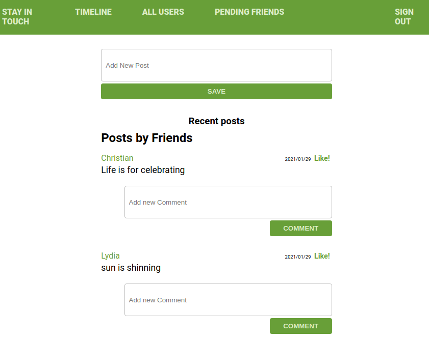

# Scaffold for social media app with Ruby on Rails

## About the Project

In this project, I have implemented a social media app That allows users to create an account, creates a post, comment on a post, like a post, send and receive friend requests



The app has the following features:

- User can create account/Log in
- A user who is a guest will only visit Signup and Sign in page
- Logged-in user can see a list of the users on the app
- Logged-in user can view profiles of all users and their posts
- Logged-in user can create posts (text only) and get likes / dislikes, and also like posts from friends
- Logged-in user has a timeline where he/she can see ONLY posts from friends
- Logged-in user can add comments to posts
- Logged-in user can send a friendship invitation and also receive invitations from other friends
- Logged-in user can decide to Accept/Reject friendship invitations

## Built With

- Ruby v2.7.0
- Ruby on Rails v5.2.4
- Rspec

## Live Demo

[Heroku-link](https://stay-in-touch-project.herokuapp.com/users/sign_in)

## Getting Started

### Prerequisites

To get this project up and running locally, you must already have ruby and necessary gems installed on your computer

To get this project set up on your local machine, follow these simple steps:

1. Open terminal
2. Clone the repository 
``` git@github.com:DeliceLydia/ror-social-scaffold.git ```
3. Cd in the project ``` ror-social-scaffold ```
4. Run ``` bundle install ```
5. Create database by running ``` rails db:create ```
6. Run database migration by running ``` rails db:migrate ```
7. Start your server ``` rails server ```
8. Run the app ``` http://localhost:3000/ ```

### Run tests

```
    rspec --format documentation
```

## Authors

👤 **Delice Lydia**
  - GitHub: [@githubhandle](https://github.com/DeliceLydia)
  - Twitter: [@twitterhandle](https://twitter.com/lameck721)
  - LinkedIn: [LinkedIn](https://twitter.com/IngabireLydia3)


TBA

## Show your support

Give a ⭐️ if you like this project!

## Acknowledgments

Credits go to the [**Microverse inc**](https://github.com/microverseinc/ror-social-scaffold) for providing initial code as a starting point of our project.


